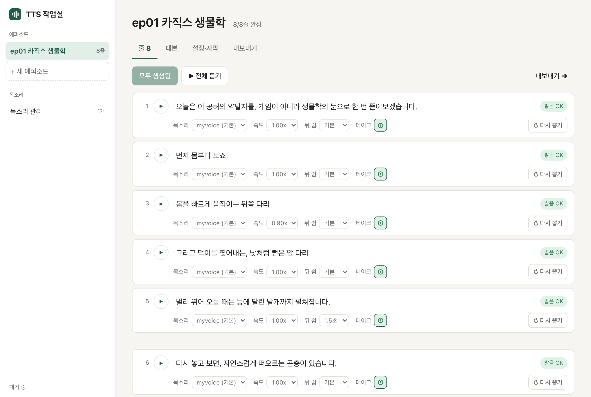

# TTS 작업실 — 내 목소리 나레이션

맥에서 대본을 넣으면 내 목소리로 나레이션을 만들고, 발음을 스스로 검사하고,
아이패드 루마퓨전으로 바로 넘길 파일(음성·자막 영상·자막)을 iCloud Drive 에 내보낸다.
인터넷·유료 API 없이 이 맥에서만 돈다.



## 처음 설치 (한 번만)

필요한 것: **애플 실리콘 맥(M1 이상, 메모리 16GB 권장)**, [Homebrew](https://brew.sh), 디스크 여유 10GB

```bash
git clone https://github.com/N-lifescience/tts-studio.git
cd tts-studio
./setup
```

파이썬 환경·화면 빌드·Dock 앱까지 만들어 준다. 음성 모델(약 7GB)은 첫 생성 때 자동으로 받는다.

## 켜기

**Dock 의 "TTS 작업실" 아이콘을 누른다.** 서버가 켜지고 브라우저가 열린다.
앱을 끄면(⌘Q) 서버도 같이 꺼진다. Dock 아이콘 밑 불빛 = 서버가 켜져 있다는 뜻.

- 아이콘이 없으면 `./make-app` → `~/Applications/TTS 작업실.app` 을 Dock 으로 끌어다 놓는다.
  폴더를 옮겼으면 `./make-app` 을 다시 실행한다.
- 터미널이 편하면 `./studio` (끄기: `Ctrl+C`).
- 10분 동안 생성을 안 하면 모델을 메모리에서 내려놓는다. 다음 생성 때 10초쯤 다시 올린다.

> ⚠️ **본인 목소리, 또는 동의를 받은 목소리만 복제하세요.**

## 작업 순서

왼쪽에서 **+ 새 에피소드** → 제목. 탭은 작업 순서대로 번호가 붙어 있다.

1. **① 목소리·자막** — 기본 목소리, 표현 다양성, 쉼 길이, 음량(LUFS), 자막 글꼴 크기·위치·색 (미리보기 있음)
2. **② 대본** — 붙여 넣고 **적용하고 생성**
   - 줄바꿈·문장 끝(. ? !)마다 따로 만들고 짧게 쉰다. 빈 줄은 문단이라 길게 쉰다.
3. **③ 음성 다듬기** — 줄마다 듣고 고친다
   - ▶ 한 줄 듣기 / **▶ 전체 듣기** (지금 나오는 줄이 노랗게 표시됨)
   - **발음 OK / 발음 확인**: 만든 음성을 다시 받아써서 대본과 비교한다. 틀리면 알아서 3번까지 다시 뽑고,
     그래도 틀리면 빨갛게 "이렇게 들렸어요 · 찢 → 뛰" 식으로 보여 준다.
     소리 나는 대로 받아쓴 것뿐이면 **이대로 쓰기**.
   - **↻ 다시 뽑기**: 새 테이크. **테이크 ①②③** 을 누르면 듣고 그걸로 쓴다.
   - **↻ 전체 다시 뽑기**: 모든 줄을 새로 뽑는다. 예전 테이크는 번호로 남아 다시 고를 수 있다.
   - 줄마다 **목소리 · 속도(0.8~1.2x) · 뒤 쉼**. 글자를 누르면 고칠 수 있고, 고치면 그 줄만 다시 만든다.
4. **④ 내보내기** → **내보내기**

왼쪽 **에피소드 · 목소리** 목록은 제목을 눌러 접고 펼 수 있다. 항목에 마우스를 올리면 나오는 🗑 로 지운다
(쓰는 에피소드가 있는 목소리는 지워지지 않는다).

## 내보내기 결과

`iCloud Drive/TTS/<에피소드 제목>/` (아이패드 파일 앱에 자동으로 뜬다) + SSD 사본 `projects/<id>/export/`

| 파일 | 루마퓨전에서 |
|---|---|
| `narration.wav` | 타임라인 0초에 오디오로 (48kHz, -14 LUFS) |
| `subtitles_green.mp4` | 위 트랙 0초 + 크로마 키(초록). 소리 없음 |
| `lines/03_00m08.1s_몸을빠르게….wav` | 줄별 조각. 파일 이름 = 원래 시작 시각 |
| `narration.srt` | 유튜브 업로드 때 자막(CC) |

루마퓨전은 타임라인 파일(XML)·SRT 불러오기를 지원하지 않아 이렇게 파일로 넘긴다.

## 목소리

**목소리 관리**에서 녹음(최대 30초)하거나 파일을 올린다. 자동으로 받아쓰니 **대본을 꼭 확인해서 고친다** —
샘플 대본이 틀리면 복제 품질이 떨어진다.

- 결과는 샘플의 말투·속도·감정을 그대로 따라간다. 톤을 바꾸고 싶으면 톤별(기본·차분·긴장감…)로 따로 녹음해
  두고 줄마다 고른다. (복제 모델이 "더 극적으로" 같은 말투 지시를 받지 않는다)
- 좋은 샘플: 20~30초, 조용한 방, 실제 나레이션과 같은 말투.

## 잘 안 될 때

- **고유명사·숫자·영어** → 대본에 소리 나는 대로 (`LoL` → `롤`, `3.14` → `삼 점 일사`)
- **자꾸 발음 확인이 뜸** → 문장을 짧게 끊거나, 들어 보고 괜찮으면 "이대로 쓰기"
- **억양이 들쭉날쭉** → 설정에서 표현 다양성을 낮춘다 (0.5~0.6)
- **느려짐** → 맥 메모리 16GB 중 모델이 최대 12GB 가까이 쓴다. 다른 무거운 앱을 닫는다.
- **"이미 켜져 있습니다"** → 다른 곳에서 켜 둔 것. 그대로 브라우저만 쓰면 된다.
- **앱이 안 켜짐** → `~/Library/Logs/tts-studio.log` 를 본다. 외장 SSD 에 두었다면 연결돼 있는지 확인.

## 구조

```
setup             처음 설치
make-app          Dock 앱 만들기 (~/Applications/TTS 작업실.app)
studio            켜기 스크립트 (화면이 바뀌었으면 자동 빌드)
server/           FastAPI 서버 (127.0.0.1 전용)
  engine.py         모델: Qwen3-TTS 1.7B(목소리 복제) · Qwen3-ASR 1.7B(발음 검사)
  check.py          자모 단위 비교 — "찢→뛰"(오류)와 "공허→공어"(소리 나는 대로)를 구분
  worker.py         생성 줄 세우기 + 진행 상황 실시간 전송(SSE)
  exporter.py       이어 붙이기·음량·조각·iCloud 복사
  subtitles.py      srt · 초록 자막 영상(Pillow + ffmpeg)
web/              화면 (React + TypeScript + Vite)
tests/            서버 테스트 (가짜 모델로 돈다): .venv/bin/python -m pytest tests
projects/         에피소드 (SSD 에만)
voices/           목소리 샘플 (개인정보 — GitHub 금지)
narrate           예전 명령줄 도구 (./narrate scripts/ep01.txt) — 여전히 동작
```

설계 결정은 [docs/PLAN.md](docs/PLAN.md), 만든 과정은 [docs/PROGRESS.md](docs/PROGRESS.md).

## 라이선스

비영리 목적으로 자기 맥에서 쓰는 것은 자유, 재배포·수정 배포·영리 이용은 사전 허락 — [LICENSE](LICENSE).
만든 음성·자막 파일은 만든 사람의 것이다. 음성 모델(Qwen3-TTS·Qwen3-ASR)은 Apache 2.0.
