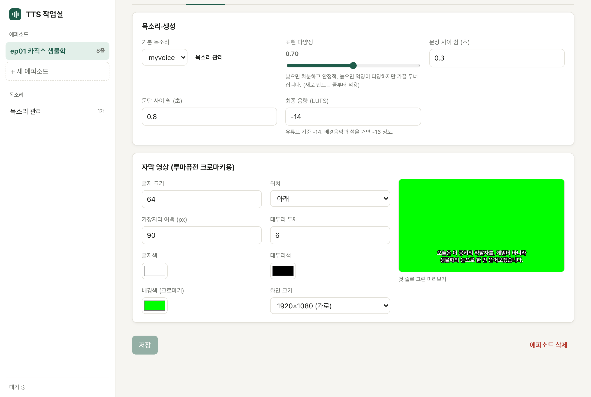

# [공유] TTS 작업실 — 내 목소리로 수업 영상 나레이션 만들기 (맥 로컬 웹앱, 무료)

> 녹음 버튼 앞에서 같은 문장을 다섯 번째 다시 읽고 있다면,
> 한 문장 고치려고 전체를 다시 녹음하고 있다면.

**30초짜리 내 목소리 샘플 하나**로, 대본을 붙여 넣으면 제 목소리로 나레이션을 읽어 주는 웹앱을 만들었습니다.
문장 하나가 마음에 안 들면 **그 줄만 다시 뽑고**, 대본을 고치면 **바뀐 줄만 다시 만듭니다.**
전부 **제 맥 안에서만** 돌아갑니다. 인터넷도, 유료 API도, 구독도 없고 목소리 샘플이 밖으로 나가지 않습니다.

유튜브 과학 영상을 만들다가 나레이션 녹음이 제일 귀찮아서 만들었습니다. 수업용 영상·플립러닝 자료 만드시는 선생님들께도 쓸모가 있을 것 같아 나눕니다.

**GitHub:** https://github.com/N-lifescience/tts-studio

---

## 🖥 이렇게 생겼습니다


- 줄마다 ▶ 듣기 · **발음 OK / 발음 확인** · 목소리 · 속도 · 뒤 쉼 · 테이크 · 다시 뽑기
- **▶ 전체 듣기**를 누르면 지금 읽는 줄이 노랗게 따라갑니다.

---

## ✨ 이런 점을 신경 썼습니다

**1. 발음을 스스로 검사합니다.**
만든 음성을 음성인식으로 다시 받아써서 대본과 비교합니다. 틀리면 **알아서 3번까지 다시 뽑고**,
그래도 틀리면 빨갛게 표시하면서 *"이렇게 들렸어요 · 찢 → 뛰"* 처럼 어디가 다르게 들렸는지 보여 줍니다.
"공허 → 공어"처럼 원래 그렇게 소리 나는 받아쓰기는 넘어가도록 **자모 단위로** 비교합니다.

**2. 영상 편집 앱에 바로 넣을 수 있게 내보냅니다.**
**내보내기** 한 번이면 아래 파일이 **iCloud Drive/TTS/에피소드 제목/** 에 생깁니다. 아이패드 파일 앱에 자동으로 뜹니다.

| 파일 | 쓰는 곳 |
|---|---|
| `narration.wav` | 타임라인 0초에 놓기 (유튜브 음량 기준 -14 LUFS로 맞춰 둠) |
| `subtitles_green.mp4` | **초록 배경 자막 영상** — 영상 위에 얹고 크로마키 |
| `lines/03_00m08.1s_….wav` | 줄별 조각. 파일 이름 = 원래 시작 시각 |
| `narration.srt` | 유튜브 자막(CC) |

저는 아이패드 **루마퓨전**으로 편집하는데, 루마퓨전은 자막 파일(SRT)을 못 불러와서 자막을 **초록 배경 영상**으로 만들어 얹는 방식을 택했습니다.
캡컷·프리미어·파이널컷에서도 wav·srt를 그대로 쓰시면 됩니다.



**3. 톤은 목소리 샘플로 고릅니다.**
결과물은 샘플의 말투·속도·감정을 그대로 따라갑니다. "기본 / 차분 / 긴장감"처럼 톤별로 30초씩 녹음해 두고 **줄마다 골라** 쓰면 됩니다.
녹음은 웹 화면에서 바로 하고, 녹음한 말은 자동으로 받아써 줍니다.

**4. 켜고 끄기가 쉽습니다.**
Dock의 **TTS 작업실** 아이콘을 누르면 켜지고 브라우저가 열립니다. 앱을 끄면 같이 꺼집니다.
10분 동안 안 쓰면 음성 모델을 메모리에서 내려놓아 다른 작업을 방해하지 않습니다.

---

## 📥 내 맥에서 쓰기 (15분 + 모델 다운로드)

**필요한 것:** 애플 실리콘 맥(M1 이상, **메모리 16GB 권장**), [Homebrew](https://brew.sh), 디스크 여유 10GB

```bash
git clone https://github.com/N-lifescience/tts-studio.git
cd tts-studio
./setup
```

1. `./setup` 이 파이썬·화면·Dock 앱까지 다 만들어 줍니다.
2. `~/Applications` 의 **TTS 작업실** 을 Dock으로 끌어다 놓고 누릅니다.
3. 처음 열면 **목소리 관리** 화면이 뜹니다. 20~30초 녹음하고, 자동 받아쓰기를 **실제로 말한 그대로** 고칩니다.
4. 새 에피소드 → 대본 붙여 넣기 → **적용하고 생성**. 첫 생성 때 모델(약 7GB)을 내려받느라 몇 분 걸립니다.

자세한 사용법은 GitHub의 README에 있습니다.

---

## ⚠️ 미리 알아두실 것

- **본인 목소리, 또는 동의를 받은 목소리만 복제해 주세요.** 학생 목소리를 쓰실 거면 반드시 본인·보호자 동의를 먼저 받으셔야 합니다.
- **애플 실리콘 맥 전용**입니다. 윈도우·인텔 맥에서는 돌지 않습니다(음성 모델이 애플 칩 전용 MLX로 돕니다).
- **한국어 나레이션**에 맞춰 두었습니다. 숫자·영어는 대본에 소리 나는 대로 쓰는 게 가장 정확합니다 (`3.14` → `삼 점 일사`).
- 속도는 M4 맥 기준 **30초 나레이션(8줄)에 1분 남짓**입니다. 생성 중에는 메모리를 12GB 가까이 쓰니 무거운 앱은 닫아 주세요.
- 발음 검사는 음성인식에 기대는 것이라 **완벽하지 않습니다.** 마지막엔 꼭 한 번 들어 보세요. 억양·감정은 기계가 판단하지 못합니다.
- **비영리 목적**이면 자유롭게 쓰실 수 있습니다. 만드신 음성·자막 파일은 선생님 것입니다. 재배포·고쳐서 나누기·유료 이용은 먼저 연락 부탁드립니다(`LICENSE` 참고).
- 음성 모델은 알리바바의 **Qwen3-TTS / Qwen3-ASR**(Apache 2.0)을 씁니다.

써 보시고 불편한 점이나 "이런 기능이 있으면 좋겠다" 하는 게 있으면 댓글이나 GitHub 이슈, 인스타그램 **@n_life_scienc** 로 알려 주세요. 🙏

— N-lifescience
